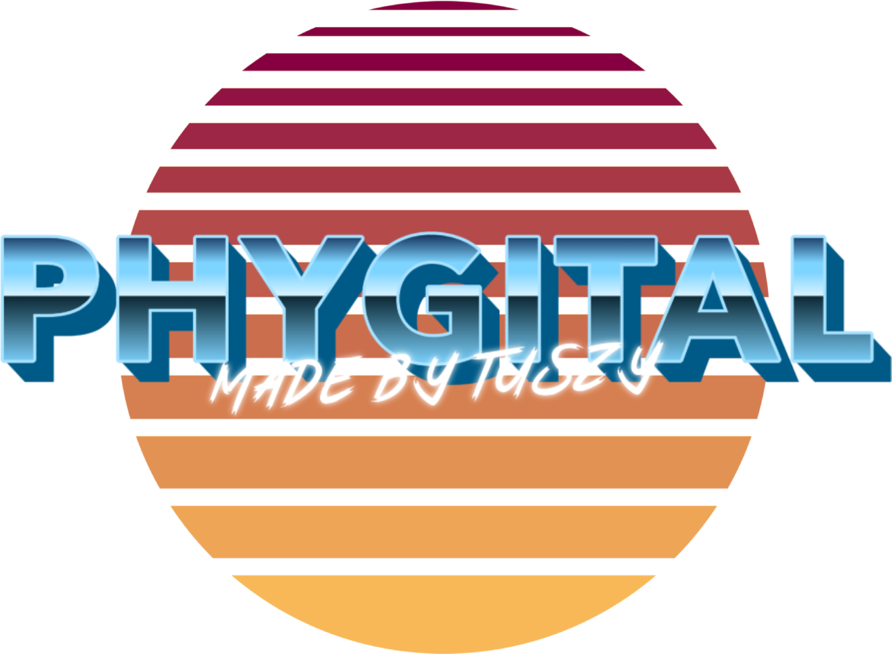
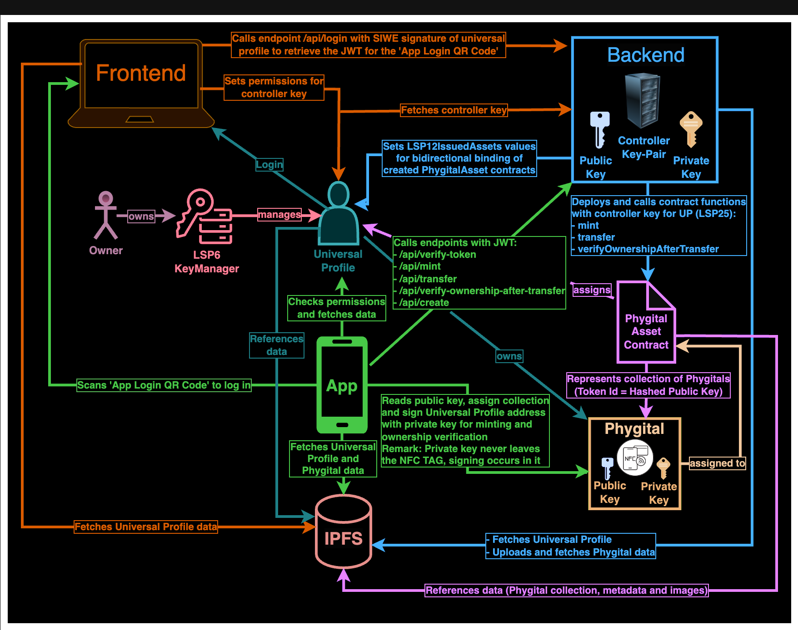

# Phygital
> Connecting the physical with the digital world through Phygitals powered by the LUKSO blockchain.

# Remarks
Testing this project will be probably impossible because you need the App and the custom made NFC tags. Due to the tight schedule, I didn't upload the app to the AppStore, nor did I send any NFC tags to the Lukso office. But I did record a bunch of videos and cut them into a blockbuster hehe... Furthermore I created a clickable Prototype PDF which contains proper navigation. Enjoy it :) 

### [Demo Video](https://www.youtube.com/watch?v=NZiShK34YZ8)
### [Prototype PDF (Must be downloaded to work properly)](Prototyping.pdf)

## Overview
| Name | Description |
| ---- | ----------- |
| Project | Phygital |
| Name | Dennis Tuszynski |
| Email | denniro@gmail.com |
| Deployed | [https://phygital.tuszy.com](https://phygital.tuszy.com) |
| Demo | [https://www.youtube.com/watch?v=NZiShK34YZ8](https://www.youtube.com/watch?v=NZiShK34YZ8) |
| Prototype PDF | [Prototype PDF](Prototyping.pdf)  (Must be downloaded to work properly)|
| GitHub | [https://github.com/Tuszy/phygital](https://github.com/Tuszy/phygital) |
| Frontend | [https://github.com/Tuszy/phygital-frontend](https://github.com/Tuszy/phygital-frontend) |
| Backend | [https://github.com/Tuszy/phygital-backend](https://github.com/Tuszy/phygital-backend) |
| App | [https://github.com/Tuszy/phygital-app](https://github.com/Tuszy/phygital-app) |
| Smart Contract | [https://github.com/Tuszy/phygital-smart-contract](https://github.com/Tuszy/phygital-smart-contract) |
| NFC Tag | [https://github.com/Tuszy/phygital-nfc-tag](https://github.com/Tuszy/phygital-nfc-tag) |

## Description (30th Oct 2023)

This project demonstrates a simple but efficient way of how to "phygitalize" a product by using an intelligent NFC tag with any modern mobile phone that supports NFC.

> Phygitalization: Making a connection between the physical and digital world based on a decentralized blockchain solution.

Phygitals allow the creative economy to onboard normies effortlessly into the digital world by leveraging traditional sales channels like physical stores. 

Nowadays most of the phygitals are firstly minted in the digital world and then transitioned into to the physical world by a process called forging (e.g. RTFKT). This process is great and innovative - but has a big disadvantage. 
The target market is reduced to tech-savvy people who must be well acquainted with the functionality of blockchain to be able to deal with its hidden risks and challenges. Transactions, gas fees, seed phrases, wallets, phishing, front running, account addresses, private keys, public keys, block explorer yada yada yada - are nothing the normie gives a shit about or rather even makes him/her drop the idea of getting involved in the new creative economy. 

So, let us change this.

We are confronted with the task of making the onboarding as simple and stupid as possible, so that everyone, no matter the age, gender, tech savviness is able to take part in the digital world. 

The problems we have to solve are not easy but manageable.
We have to ask ourselves what do the normie understand and how much time is he/she ready to spend in todays "short attention" world (thanks TikTok...) to get involved. 

Let's assume that everyone who is using the internet, has got a modern mobile phone with NFC functionality. Furthermore we also expect that they know how to surf the internet with a browser and download an app. Awesome! We have everything that we need to implement our solution:

We need:

1. Simple Web Application to add a controller to the key manager of the universal profile 
2. Intelligent NFC tag that can be embedded into any physical product
3. Mobile Application that allows us to communicate with the NFC tag and connect it to the blockchain  (=> phygitalize the product)
4. Smart Contract that allows us to mint the product ("digital twin") on the blockchain

All of the above tasks must be implemented within 4 weeks during Lukso's BuildUP Hackathon #2 (30th Oct till 27th Nov). Not a lot of time, so I'll probably have to cut some corners. Please keep in mind, that I am a dev with almost no know-how in electronics, so the NFC tag implementation will probably lack best practices and will not be ready for production. Nevertheless I wanted to accept the challenge since I love the idea of the Lukso Tag and it was the reason why I got interested in Lukso in August 2020.

## Conclusion (26th Nov 2023)

Wow.... This was a hell of a ride for me... 4 weeks of pure grinding, complete focus, no distractions, 12-14h daily shifts, no day off. Made a lot of mistakes, but also learned a lot of new stuff (e.g. Flutter, NFC tech, PCB design and new Lukso standards).

Here we are at the end of Lukso's Build UP Hackathon #2. I can happily say that I have managed to implement all of the requirements I have set for myself. Of course the communication between the mobile phone and the custom made NFC Tag does not work as perfect as I would like it to work, because of the tricky energy harvesting feature, but come on, it is just a prototype and maybe the beginning for any company that would like to adopt and develop it into a perfect working solution. All of the things I have been working on will be completely open source. You can do with it whatever you want. Have fun :)

Working with [Flutter](https://flutter.dev/) was a breeze, I strongly suggest anyone who is interested in cross-platform app development to try it out. Especially for dApps ;) Actually this was the first time I built something with Flutter, so please do not expect any best practices. Keep in mind that I created this app in one and a half weeks, next to all the other stuff that had to be implemented. Because of this reason and the tight schedule I did not submit the app to the AppStore, the reviews would probably take longer than the development of the app. Aside from that it would not even make sense to submit it, since you need the custom made [NFC Tags](https://github.com/Tuszy/phygital-nfc-tag) to play around with it. Therefore I have created a bunch of videos which show every possible scenario.

Thanks for reading.

## Videos

### [Demo Video](https://www.youtube.com/watch?v=NZiShK34YZ8)

### [Happy Path Test](https://www.youtube.com/playlist?list=PLQpnsw6jmPYCZmlyFtWERB9vC6mmc03E8)

### Uncut Raw Footage used for the Demo Video

[Login with Universal Profile](https://www.youtube.com/playlist?list=PLQpnsw6jmPYBJ4lbrHXlMIEk0v2I17c-D)

[Read Phygital](https://www.youtube.com/playlist?list=PLQpnsw6jmPYC7JLNTCARlFiPlVy4bC1cE)

[Mint Phygital](https://www.youtube.com/playlist?list=PLQpnsw6jmPYBVahulN1zJ_rx158ZnSdHd)

[Transfer Phygital](https://www.youtube.com/playlist?list=PLQpnsw6jmPYC7pvrLr02VObxAkHTm9Hl1)

[Verify Ownership of Phygital after Transfer](https://www.youtube.com/playlist?list=PLQpnsw6jmPYBGBBZnC341WkGRZf0H4Xjs)

[Create Phygital](https://www.youtube.com/playlist?list=PLQpnsw6jmPYCvuaZVHANWPVAUEDKvUf_F)
